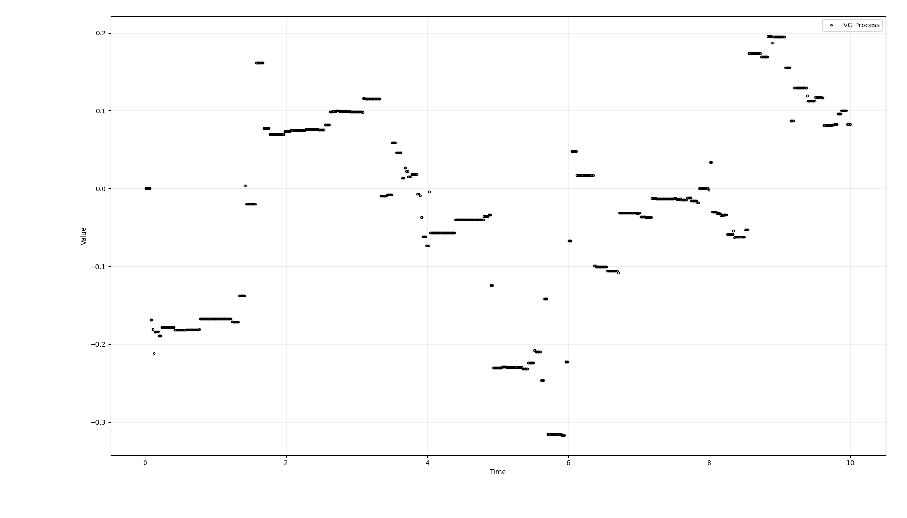

---js
const title = "Monte-Carlo Neural Approximation with a Physics-Informed Neural Network";
const date = "2026-03-10";
const draft = false;
const status = "wip";
---

_Article en cours d'écriture._

We use CUDA to generate european call option pricings in the VG model with a Monte-Carlo simulation. We then wrote python bindings to use torch to train a model to replicate the MC simulation results using data generated on-the-fly.

Code : https://github.com/fntb/vg-model-nn-approximation

## Notes on the Loss

Given a random variable $x$ dependant on $\theta$, our goal is to regress $\mu(\theta) := \mathbb{E}[x \vert \theta]$.

We have access to a dataset $\set{x_j \vert \theta_i}$ with $i \in \set{1 \dots n}$ and $j \in \set{1 \dots m}$. We assume that for each $i$ $\set{x_j \vert \theta_i}_j$ are $i.i.d$ ; and that $\set{\theta_i}_i$ are $i.i.d$ too.

For all $i$, we write $\hat{\mu}(\theta_i) := \sum_{j = 1}^m x_j \vert \theta_i$ the conditional empirical mean and $\hat{\sigma}(\theta_i)$ the (conditional) empirical variance.

Suppose that $m$ is large, and - motivated by the TCL, LGN and Slutsky's theorem - assume that :

$$\sqrt{m} \frac{(\hat{\mu}(\theta) - \mu(\theta))}{\sqrt{\hat{\sigma}(\theta)^2}} \sim \mathcal{N}(0, 1)$$

Condition by $\hat{\sigma}(\theta)^2$ and rewrite :

$$\hat{\mu}(\theta) \vert \hat{\sigma}(\theta)^2 \sim \mathcal{N}(\mu(\theta), \frac{\hat{\sigma}(\theta)^2}{m})$$

Note that $\set{\theta_i}_i$ being supposed $i.i.d$, $\set{\hat{\mu}(\theta_i) \vert \hat{\sigma}(\theta_i)^2}_i$ are too which justifies the use of the likelihood.

So we then have the negative conditional log-likelihood :

$$
- \log{\prod_{i = 1}^n p(\hat{\mu}(\theta_i) \vert \hat{\sigma}(\theta_i)^2)} \propto \sum_{i = 1}^n \frac{(\hat{\mu}(\theta_i) - \mu(\theta_i))^2}{2 \hat{\sigma}(\theta_i)^2 / m}
$$

And minimizing this criteria will give us the MLE.

#### Linking to the Loss Function Choice in the case of Approximating a Monte-Carlo simulation using a Neural Network

Now to put this in context, we have a stochastic function $f$ and a dataset of parameters $\set{\theta_i}$, we want to learn a parametric function $\mu_\phi$ (i.e. a neural network) to approximate $\mu : \theta \to \mathbb{E}[f(\theta)]$. 

To accomplish this we generate, for each $\theta_i$, $m$ simulations $\set{f(\theta_i)_j}_j$ (the $x_j\vert \theta_i$ in our previous explanation) of which we take the empirical mean $\hat{\mu}(\theta_i)$ (i.e. the monte-carlo simulation of $\mathbb{E}[f(\theta_i)]$) and empirical variance $\hat{\sigma}(\theta_i)^2$. 

We can then train our neural network by gradient descent on the MLE objective (i.e. the aforementionned NLL, which is in the end a simple weighted MSE) :

$$\operatorname{WMSE}(\mu_\phi(\theta_i), \hat{\mu}(\theta_i) \vert \hat{\sigma}^2(\theta_i), m) = \sum_{i=1}^n \frac{(\hat{\mu}(\theta_i) - \mu_\phi(\theta_i))^2}{\hat{\sigma}^2(\theta_i) / m}$$

#### Handling Floating Point Precision Errors

We face a last issue, as we assumed $m$ to be large, the Monte-Carlo estimate may be _too_ good, and the variance $\hat{\sigma}(\theta)^2$ may be very close to $0$ which would cause `NaN` issues in the previous objective function since we divide by $\hat{\sigma}(\theta)^2$.

To edge against this we can model a noise component interpreted as the machine (floating point) precision. Instead of assuming 

$$\hat{\mu}(\theta) \vert \hat{\sigma}(\theta)^2 \sim \mathcal{N}(\mu(\theta), \frac{\hat{\sigma}(\theta)^2}{m})$$

Assume that :

$$\hat{\mu}(\theta) \vert \hat{\sigma}(\theta)^2 \sim \mathcal{N}(\mu(\theta), \frac{\hat{\sigma}(\theta)^2}{m}) + \mathcal{N}(0, \epsilon)$$

We get :

$$\operatorname{WMSE}(\mu_\phi(\theta_i), \hat{\mu}(\theta_i) \vert \hat{\sigma}^2(\theta_i), m) = \sum_{i=1}^n \frac{(\hat{\mu}(\theta_i) - \mu_\phi(\theta_i))^2}{\hat{\sigma}^2(\theta_i) / m + \epsilon}$$

#### Conclusion

- The weighted MSE is not a default choice, but instead is justified as a proper Maximum Likelihood Estimation ;
- Our only two hypothesis where "$p$ is large" - which it is at $2^7$ - and "conditionned on $\set{\hat{m}(\theta), \hat{\sigma}(\theta)}$" - which translates to "Assuming the MC estimate is the true parameter".
