---js
const title = "Weight Normalization";
const description = "Analyse et expériences sur la Weight Normalization";
const date = "2026-04-16";
const draft = false;
---

On s'intéresse à la weight normalization telle que présentée [dans _Weight Normalization: A Simple Reparameterization to Accelerate Training of Deep Neural Networks_, par Salimans et Kingma](https://arxiv.org/abs/1602.07868).

## Présentation

On appelle une **couche linéaire** d'un réseau de neuronne une fonction linéaire $y = x \mapsto wx + b$ où $b \in \mathbb{R}^q$ et $w \in \mathbb{R}^{q \times p}$ sont les paramètres.

$y$ est appelée **préactivation** au sens où une couche linéaire est généralement composée avec une fonction d'activation non linéaire $\phi$ dont la sortie est appelée **activation**. $\phi$ est typiquement une fonction point à point (e.g. $ReLU$, $softplus$, $GELU$, etc).

Il existe aujourd'hui de nombreux types de réseaux de neuronnes, mais la simple compositions récursive de couches linéaires et activations non-linéaire reste le block fondationnel et omniprésents. Lorsque utilisé en isolation on parlera généralement de MLP (Multi-Layer Perceptron), tandis que lorsqu'utilisé en tant que block dans un plus grand réseau on pourra parler de FFN (Feed Forward Network). Un autre exemple d'autorité se trouve en les matrices key, query, et value des mécanisme d'attentions.

La normalisation est un ensemble de techniques visant à stabiliser la distribution des (pré-)activations et des gradients pour permettre l'entrainement de réseaux profonds. Tandis que certaines méthodes (e.g. Batch Normalization) interviennent directement sur les données en les recentrant et réduisant, d'autres (e.g. Weight Normalization) agissent sur la structure des paramètres pour améliorer le conditionnement de l'optimisation. 

La **weight normalization** consiste à repéramètrer les couches linéaires sous la forme

$$y = g\frac{v}{\| v \|}x + b$$

où $g$ est un scalaire, $v$ une matrice de même dimension que $w$, et $b$ un vecteur.

Remarquons de suite que cette reparamétrisation ne change en rien l'expressivité de la couche (i.e. les deux choix de paramétrisation couvrent la même classe de fonction).

<div style="page-break-after: always"></div>

## Analyse du gradient

::: foldable Dérivation des gradients

Considérons donc une telle couche linéaire normalisée $y = g \frac{v}{\|v\|} x + b$, pendant l'entraînement, on cherche à minimiser une erreur empirique d'une perte (fonction réelle) $l$ :

$$l = l(y, y^*)$$

On procède par descente de gradient, pour cela il nous faut évaluer le gradient de $l$ sur tous les paramètres du réseau. Pour notre couche linéaire normalisée, il nous faut donc obtenir :

$$\nabla_g l \text{ , } \nabla_v l \text{ et } \nabla_b l$$

On suppose avoir $\nabla_y l$ et on sait que $dl = \langle \nabla_y l, dy \rangle$ où $d$ est l'opérateur différentiel et $\langle \cdot, \cdot \rangle$ le produit scalaire approprié (la norme deux pour les vecteurs et la norme de Frobenius pour les matrices).

##### Calcul de $\nabla_b l$

$dy = db$ donc $dl = \langle \nabla_y l, db \rangle$ et on identifie immédiatement $\nabla_b l = \nabla_y l$

##### Calcul de $\nabla_g l$

$dy = (dg) \frac{v}{\|v\|}x$ donc $dl = \langle \nabla_y l, dg \frac{v}{\|v\|}x \rangle = \langle \nabla_y l^\top \frac{v}{\|v\|}x , dg \rangle$ donc on identifie $\nabla_g l = \nabla_y l^\top \frac{v}{\|v\|}x$

##### Calcul de $\nabla_v l$

$$dy = g \cdot d\left(\frac{v}{\|v\|}\right) \cdot x$$

Déjà remarquons que $\frac{\partial}{\partial v_{ij}} \|v\| = \frac{\partial}{\partial v_{ij}} \sqrt{\sum_{i,j} v_{ij}^2} = \frac{1}{2\sqrt{\sum_{i,j} v_{ij}^2}} \frac{\partial}{\partial v_{ij}} \sum_{i,j} v_{ij}^2 = \frac{v_{ij}}{\|v\|}$ donc $d\|v\| = \langle \nabla_v \|v\|, dv \rangle = \sum_{i,j} \frac{\partial}{\partial v_{ij}} \|v\| \cdot dv_{ij}$
$= \sum_{i,j} \frac{v_{ij}}{\|v\|} dv_{ij} = \langle \frac{v}{\|v\|}, dv \rangle$


Donc finalement on obtient $d \frac{v}{\|v\|} = \frac{dv}{\|v\|} + v \left( -\frac{1}{\|v\|^2} \right) \langle \frac{v}{\|v\|}, dv \rangle$

Réinjectons pour retrouver le gradient : 

$$\begin{aligned}
dl &= \langle \nabla_y l, g \, d\frac{v}{\|v\|} \cdot x \rangle \\
&= \langle \nabla_y l, \frac{g}{\|v\|} \left[ dv - \frac{v}{\|v\|^2} \langle v, dv \rangle \right] x \rangle
\end{aligned}$$

or

$$\begin{aligned}
\langle \nabla_y l, \frac{g}{\|v\|} dv \, x \rangle &= \frac{g}{\|v\|} \nabla_y l^\top dv \, x \\
&= \frac{g}{\|v\|} \text{tr}(x \nabla_y l^\top dv) \\
&= \frac{g}{\|v\|} \text{tr}((\nabla_y l x^\top)^\top dv) \\
&= \frac{g}{\|v\|} \langle \nabla_y l x^\top, dv \rangle
\end{aligned}$$

et
$$\begin{aligned}
\langle \nabla_y l, \frac{g}{\|v\|} \left( -\frac{v}{\|v\|^2} \langle v, dv \rangle \right) x \rangle &= \nabla_y l^\top \frac{g}{\|v\|} \left( -\frac{v}{\|v\|^2} \right) \langle v, dv \rangle x \\
&= \frac{g}{\|v\|} \left( -\frac{\nabla_y l^\top v x}{\|v\|^2} \right) \langle v, dv \rangle \\
&= \langle -\frac{g}{\|v\|} \frac{\nabla_y l^\top v x}{\|v\|^2} v, dv \rangle
\end{aligned}$$

donc finalement :
$$\begin{aligned}
\nabla_v l &= \frac{g}{\|v\|} \left( \nabla_y l x^\top - \frac{\nabla_y l^\top v x}{\|v\|^2} v \right) \\
&= \frac{g}{\|v\|} \left( \nabla_y l x^\top - \underbrace{\frac{\langle \nabla_y l x^\top, v \rangle}{\|v\|^2} v}_{P_v(\nabla_y l x^\top)} \right) \\
&= \frac{g}{\|v\|} \underbrace{P_v^\perp \nabla_y l x^\top}_{\perp v}
\end{aligned}$$

> Aussi, si l'on prend la couche linéaire classique $y = wx + b$, on a $dl = \langle \nabla_y l, dw \, x \rangle = \langle \nabla_y l x^\top, dw \rangle$ donc $\nabla_w l = \nabla_y l x^\top$.
> donc on a :
> $$\nabla_w l = \frac{g}{\|v\|} P_v^\perp \nabla_y l x^\top = \frac{g}{\|v\|} P_v^\perp \nabla_w l$$

<div style="page-break-after: always"></div>

:::

#### Observations

Rappelons les gradients obtenus :

$$\begin{aligned}
\nabla_b l &= \nabla_y l \\
\nabla_g l &= \nabla_y l^\top \frac{v}{\|v\|} x \\
\nabla_v l &= \frac{g}{\|v\|} P_v^\perp \nabla_y l x^\top \\
\end{aligned}$$

1. **$\nabla_g l$ ne dépend pas du tout de la norme de $v$.**

2. Dans l'update de la GD (descente de gradient) on a $v \leftarrow v - \eta \nabla_v l$ or $\|v - \eta \nabla_w l\|^2 = \sqrt{\|v\|^2 + \eta^2\frac{g^2}{\|v\|^2} \|\nabla_y l x^\top\|^2} \ge \|v\|$

Puisque 1. et 2. $\frac{g}{\|v\|}$, et donc $\nabla_v l$, sous l'effet de $v$ ne font que diminuer au fil de l'entrainement, on a donc apparition d'un **préconditionnement du gradient de $v$ qui agit comme stabilisateur**.

<div style="page-break-after: always"></div>

## Effet de l'initialization

Au delà du préconditionnement du gradient, les techniques comme la batch normalization, permettent de controler l'échelle des préactivations à chaque couche. Cette propriété justifie l'initialisation aléatoire des paramètres du réseau dans les modèles classiques (e.g. [Xavier](https://proceedings.mlr.press/v9/glorot10a/glorot10a.pdf?ref=blog.kusho.ai) ou [He](https://arxiv.org/abs/1502.01852)). 

A contrario la weight normalization n'a pas cette propriété. Les auteurs proposent une technique d'initialisation dépendante des données qui consiste à observer la préactivation de chaque couche sur un batch (comme la batch normalization) pour initialiser les poids.

Si l'on considère :

$$y = w x + b$$

On a :

$$
\begin{align*}
\mathbb{E}y &= w \mathbb{E}x + b \\
\operatorname{var} y &= w \operatorname{var}x w^\top \\
\end{align*}
$$

Et donc en supposant $\operatorname{var}x$ strictement positive (elle est déjà nécessairement positive), prendre

$$
\begin{align*}
w &=  (\operatorname{var}x)^{-\frac{1}{2}}\\
b &= - w \mathbb{E}x \\
\end{align*}
$$

satisfait les contraintes $\mathbb{E} y = 0$ et $\operatorname{var} y = I$.

On pose alors 

$$
\begin{align*}
v &=  w\\
g &=  \|w\|\\
\end{align*}
$$

Evaluer $(\operatorname{var}x)^{-\frac{1}{2}}$ a une complexité en $O(\dim(x)^3)$, si l'on veut éviter ça on peut supposer la décorrélation de $x$ et prendre la matrice diagonale $(w_{i,j} = \delta_{i = j}\frac{1}{\sqrt{(\operatorname{var} x)_{i,j}}})_{i,j}$.

Pour estimer les inconnues $\mathbb{E}x$ et $\operatorname{var}{x}$, on peut simplement prendre les estimateurs de moyenne et variance empiriques sur un batch de données (comme le fait la batch normalization).

<div style="page-break-after: always"></div>

## Experience : Validation des résultats mathématiques sur un problème simple

On propose une expérience simple visant à valider les résultats mathématiques précédemment obtenus.

On résout un problème de régression linéaire en dimension 32 (à 2) et on observe les valeurs de $g$, $\|v\|$, et surtout du pas de gradient effectif $\|\nabla_v\|$.

On optimise par SGD pour interpréter les résultats facilement (e.g. sans avoir à gérer les approximation du second ordre d'Adam).

#### Implémentation

On commence par définir la couche linéaire normalisée, qui sera réutilisée dans toutes nos expériences.

_Note : torch implémente déjà la weight normalization avec [torch.nn.utils.weight_norm()](https://docs.pytorch.org/docs/stable/generated/torch.nn.utils.weight_norm.html)._

```python

class WNLinear(nn.Linear):
    def __init__(
        self, 
        in_features: int, 
        out_features: int, 
        bias: bool = True,
        initialize: bool = False,
        device=None, 
        dtype=None
    ) -> None:
        super().__init__(in_features, out_features, bias, device, dtype)
        
        self.v = nn.Parameter(self.weight.data.clone())
        self.g = nn.Parameter(torch.norm(self.weight.data))
        
        self.register_buffer('initialized', torch.tensor(not initialize, dtype=torch.bool))

    def forward(self, input: torch.Tensor) -> torch.Tensor:
        if not self.initialized:
            self._initialize(input)

        weight = self.g * (self.v / torch.norm(self.v, keepdim=True))

        return nn.functional.linear(input, weight, self.bias)
    
    @torch.no_grad()
    def _initialize(self, input: torch.Tensor):
        output = nn.functional.linear(input, self.v / torch.norm(self.v, keepdim=True))
        
        mean = output.mean()
        std = output.std()
        
        self.g.copy_( (1.0 / (std + 1e-5)) )
        
        if self.bias is not None:
            self.bias.copy_(-mean / (std + 1e-5))
            
        self.initialized.fill_(True)
```

Puis notre `IterableDataset` synthétique :

```python
class LinearDataset(torch.utils.data.IterableDataset):
    def __init__(self, in_dims: int, out_dims: int, sigma: float = 0.1):
        super().__init__()
        self.w = torch.randn(out_dims, in_dims)
        self.b = torch.randn(out_dims)
        self.sigma = sigma

    def __iter__(self):
        while True:
            x = torch.randn(self.w.size(1))
            y = self.w @ x + self.b + torch.randn(self.w.size(0)) * self.sigma
            
            yield x, y
```

Et boucle d'entrainement (Single-Pass SGD) :

```python
def main():
    cuda = torch.cuda.is_available()
    device = torch.device("cuda" if cuda else "cpu")

    in_dims = 32
    out_dims = 2
    batch_size = 1
    epoch_max = 1000

    dataset = LinearRegressionDataset(in_dims, out_dims, sigma=0.1)
    dataloader = torch.utils.data.DataLoader(dataset, batch_size=batch_size)

    # model = nn.Linear(in_dims, out_dims, device=device)
    model = WNLinear(in_dims, out_dims, device=device)

    loss_fn = nn.MSELoss().to(device)
    optimizer = optim.SGD(model.parameters(), lr=0.05)

    tracker = Tracker()

    for epoch in tqdm(range(epoch_max), total=epoch_max):
        model.train()
        x, y = next(iter(dataloader))
        x, y = x.to(device), y.to(device)

        y_hat = model(x)
        loss = loss_fn(y_hat, y)
        
        optimizer.zero_grad()
        loss.backward()
        optimizer.step()
```

#### Résultats

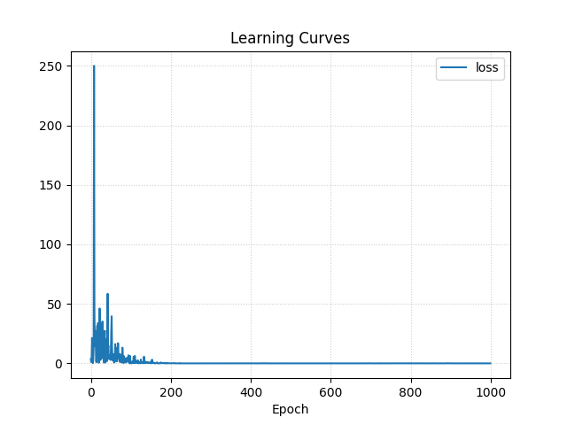
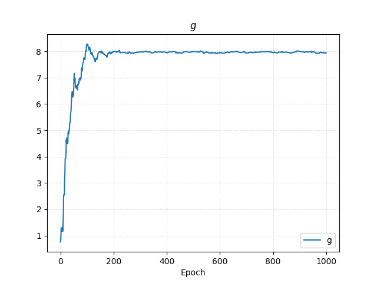
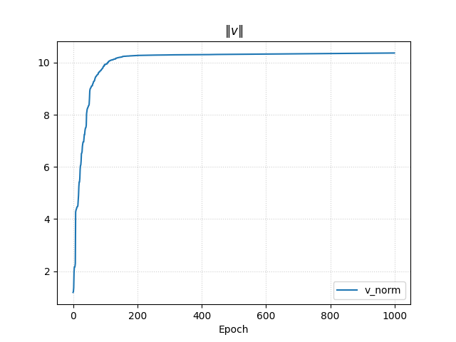
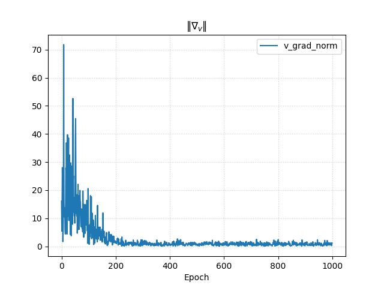


<div style="page-break-after: always"></div>

## Expérience : Edge of Stability

On propose une expérience dont l'objectif est de mesurer et visualiser la rosbustesse au pas de gradient (learning rate) avec et sans weight normalization.

Pour pouvoir visualiser confortablement le chemin d'optimisation on considère un problème de régression linéaire non biaisé en dimension 2.

$$\underset{w \in \mathbb{R}^2}{\min} \mathbb{E} \|w^\top x - y\|^2$$

où $y = w_*^\top x + \epsilon$ avec $\epsilon \sim \mathcal{N}(0, \sigma^2)$.

Et on suppose avoir un jeu de donné $\set{(x_i, y_i)}_i$ i.i.d., tel que $x \sim \mathcal{N}(0, \tau^2)$ où $\tau^2$ est connu.

On sait [annexe] que la SGD va pouvoir converger vers $w_*$ ssi $\eta < \frac{1}{2 \tau^2}$. L'idée est alors d'essayer d'apprendre $w_*$ à la limite de stabilité, c'est à dire lorsque $\eta \to \frac{1}{2 \tau^2}$. Pour ça on affiche le chemin d'optimisation pour plusieurs valeurs de $\eta$.

#### Implémentation

On commence par réimplémenter un `IterableDataset` :

```python
class LinearEoSDataset(torch.utils.data.IterableDataset):
    def __init__(self, tau: float = 1., sigma: float = 0.1):
        super().__init__()
        # On décentre légèrement pour éviter \theta_0 \approx \theta^*
        self.w = torch.randn(2, 1) + (torch.randn(2, 1) * 10 * tau)
        self.sigma = sigma
        self.tau = tau

    def __iter__(self):
        while True:
            x = torch.randn(self.w.size(1)) * self.tau
            y = self.w @ x + torch.randn(self.w.size(0)) * self.sigma
            yield x, y
```

Ainsi que notre boucle d'entrainement (Unbatched Single-Pass SGD) :

```python
def main():
    in_dims = 2
    out_dims = 1
    batch_size = 1
    epoch_max = 400

    dataset = LinearEoSDataset(tau=1, sigma=0.1)
    dataloader = torch.utils.data.DataLoader(dataset, batch_size=1)

    learning_rate = (2 / (2 + in_dims) * 1 / 1. ** 2) * 1.

    # model = nn.Linear(2, 1)
    model = WNLinear(2, 1)

    loss_fn = nn.MSELoss()
    optimizer = torch.optim.SGD(model.parameters(), lr=learning_rate)

    for epoch in (progress := tqdm(range(epoch_max), total=epoch_max)):
        model.train()
        x, y = next(iter(dataloader))

        y_hat = model(x)
        loss = loss_fn(y_hat, y)
        
        optimizer.zero_grad()
        loss.backward()
        optimizer.step()
```

#### Résultats

On observe bien que la régression linéaire normalisée (i.e. obtenue en reparamétrant $w = g \frac{v}{\|v\|}$) reste notablement plus stable lorsque le learning rate atteind la limite théorique.

##### Régression Linéaire avec $\eta = \frac{1}{2} \frac{1}{2 \tau^2}$

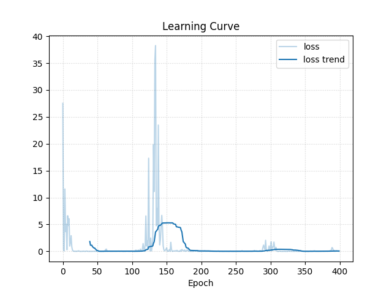
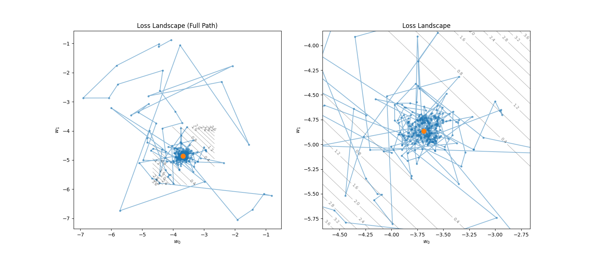

##### Régression Linéaire avec $\eta = \frac{1}{2 \tau^2}$

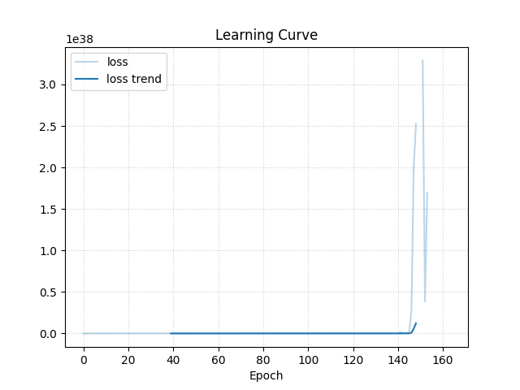
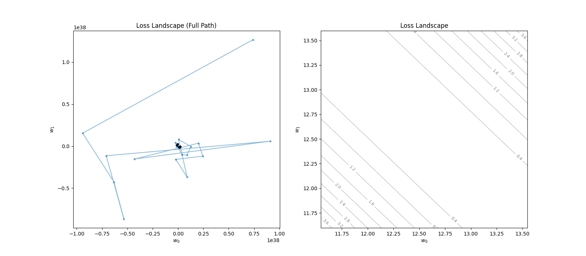

##### Régression Linéaire **Normalisée** avec $\eta = \frac{1}{2} \frac{1}{2 \tau^2}$

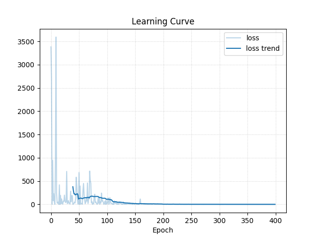
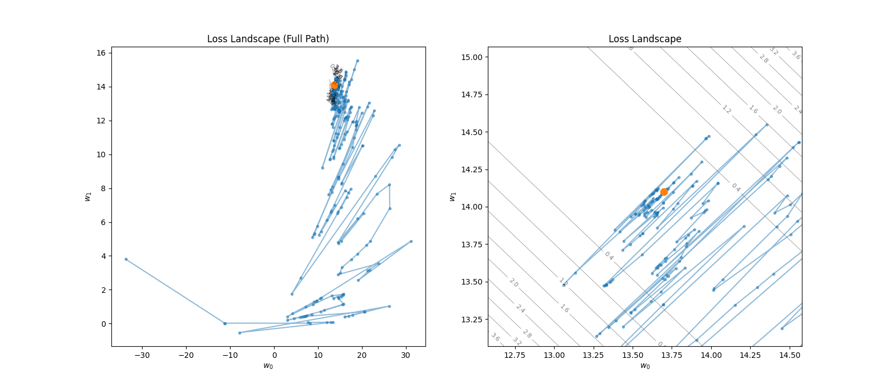

##### Régression Linéaire **Normalisée** avec $\eta = \frac{1}{2 \tau^2}$

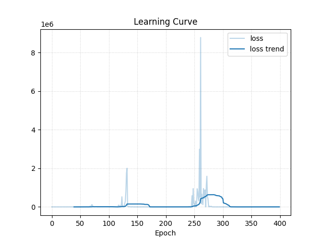
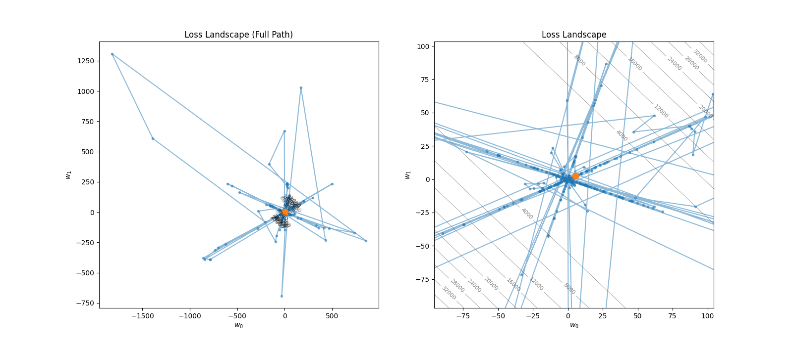

<div style="page-break-after: always"></div>

## Expérience : Apprentissage profond par weight normalization

On propose une expérience visant à valider que la weight normalization permet l'entraînement de réseaux profonds.

Dans cette expérience on construit un MLP (Multi-Layer Perceptron) de 20 couches, sans connexions résiduelles, qu'on entraine pour apprendre l'identité $x \mapsto x$. 

On compare l'entrainement et l'évolution des gradients dans les cas sans normalisation, avec weight normalization, et avec batch normalization.

#### Implémentation

```python
class IdentityMLP(nn.Module):
    def __init__(self, dim: int, depth: int, normalization: str = "none") -> None:
        super().__init__()

        if normalization == "weight_normalization":
            self.layers = nn.ModuleList([
                WNLinear(dim, dim, initialize=True) for _ in range(depth)
            ])
        elif normalization == "batch_normalization":
            self.layers = nn.ModuleList([
                nn.Sequential(
                    nn.Linear(dim, dim),
                    nn.BatchNorm1d(dim)
                ) for _ in range(depth)
            ])
        elif normalization == "none":
            self.layers = nn.ModuleList([
                nn.Linear(dim, dim) for _ in range(depth)
            ])
        else:
            raise ValueError(f"Unknown normalization method '{normalization}'")


        self.head = nn.Linear(dim, dim, bias=False)

    def forward(self, x: torch.Tensor):
        for layer in self.layers:
            x = layer(x)
            x = nn.functional.relu(x)

        return self.head(x)
```

Et notre boucle d'entrainement :

```python
def main():
    dim = 32
    depth = 20
    batch_size = 100
    epoch_max = 100000

    model = Identity(dim, depth, normalization="weight_normalization")
    loss_fn = nn.MSELoss()
    optimizer = torch.optim.SGD(model.parameters(), lr=0.05)

    for epoch in (progress := tqdm(range(epoch_max), total=epoch_max)):
        x = torch.randn((batch_size, dim))

        y_hat = model(x)
        loss = loss_fn(y_hat, x)

        optimizer.zero_grad()
        loss.backward()
        optimizer.step()
```

#### Résultats

##### Sans normalisation

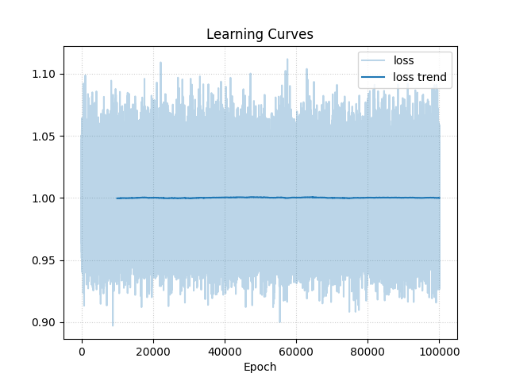
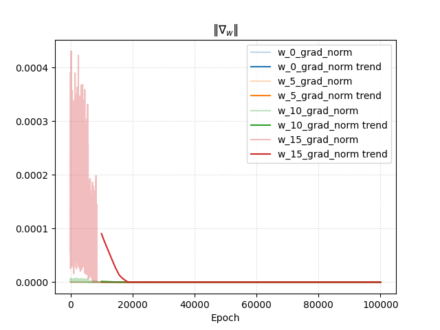

Le réseau ne parvient pas à apprendre, le gradient vanish dans les couches les plus anciennes, jusqu'à ce que la SGD s'installe dans un minimum local très mauvais.

##### Batch Normalization

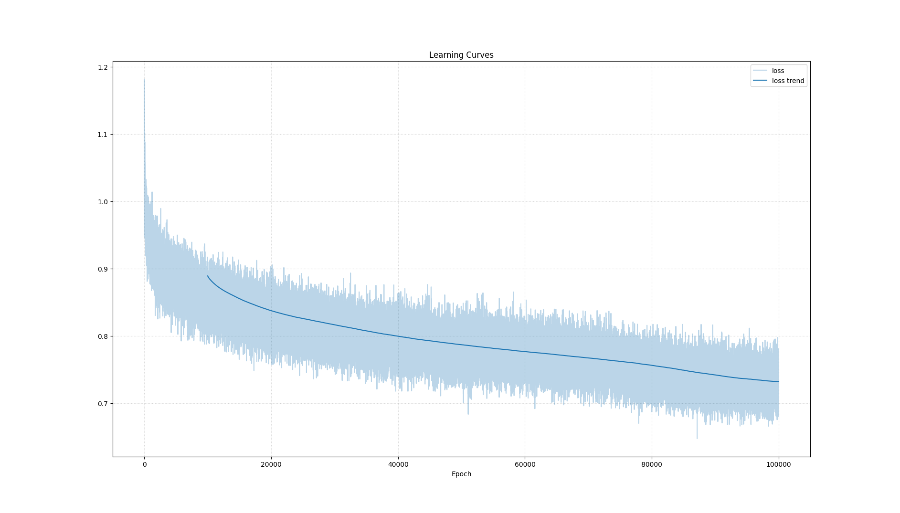
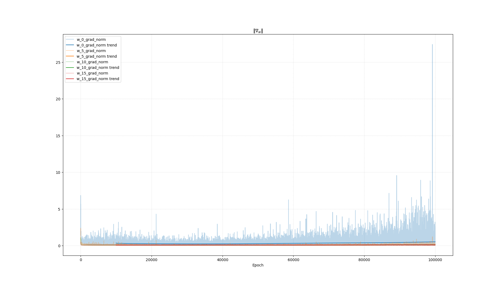

L'apprentissage est lent, très bruyant malgrès des batch de 100, mais le signal se propage très bien jusqu'aux premières couches. _C'est un peu difficile a voir mais la norme du gradient à la première couche est **plus élevée** que celle aux dernières couches._

##### Weight Normalization

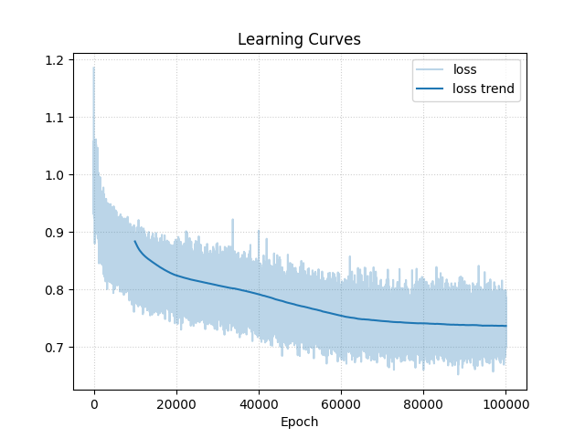
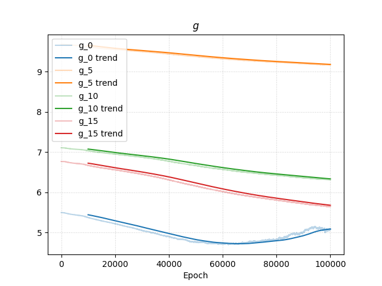
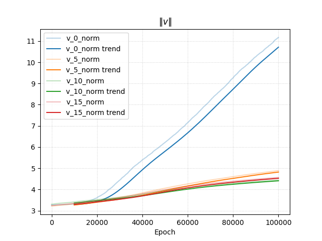
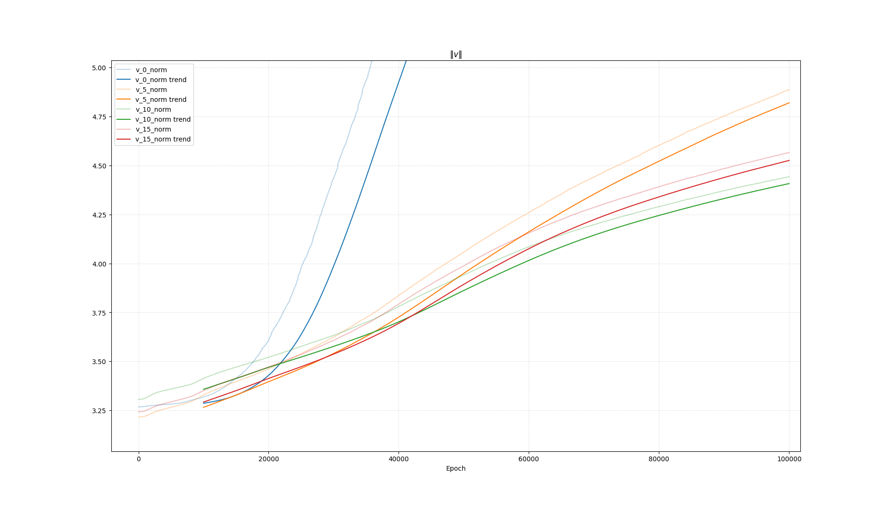
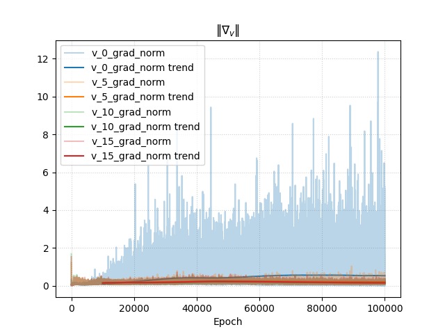
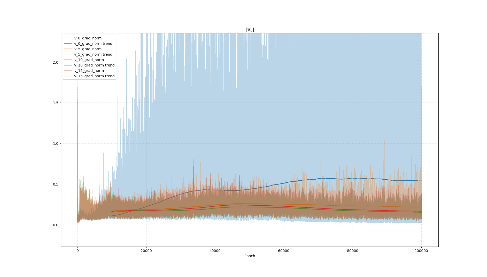

L'apprentissage n'est qu'anecdotiquement plus rapide que dans le cas de la batch normalization mais existe bien. Les performances finales sont similaires. On observe cependant que le bénéfice de normalisation est légèrement moindre que celui de la batch normalization : le gradient est sain sur les 15 dernières couches, mais celui de la couche initiale est très faible initialement puis très mal conditionné. Cependant rappelons bien que l'on a travaillé avec des batch de 100, ce qui est très favorables à la batch normalization.

<div style="page-break-after: always"></div>

## Ouvertures et aller plus loin

#### Analyse spectrale de la Hessienne

#### Composition de la weight normalization avec la mean-only batch normalization

#### Comparaison aux méthodes de normalization courante - layer normalization

#### La niche RL

#### La weight standardization

#### Reparametrisation des mécanismes d'attentions

<div style="page-break-after: always"></div>

## Annexe

::: foldable Single-Pass SGD

### Annexe : Single-Pass SGD

Référence : [Optimization for Machine Learning, Raphaël Berthier - _Sorbonne University MS2A Lecture Notes 2026_](https://github.com/raphael-berthier/optim-notes/blob/main/notes.pdf)

#### La descente de gradient stochastique abstraite (SGD)

On considère $f : \mathbb{R}^p \to \mathbb{R}$ une fonction différentiable à minimiser. On suppose ne pas avoir accès à $\nabla f(\theta)$ mais être en mesure d'échantillonner $\xi \sim p(\xi)$ et d'évaluer une $g(\theta, \xi)$ telle que :

$$\mathbb{E}[g(\theta, \xi)] = \nabla f(\theta)$$

On appellera $g(\theta, \xi)$ le **gradient stochastique** de $f$ en $\theta$.

L'algorithme de SGD (Stochastic Gradient Descent) est défini comme

$$
\begin{array}{ll}
\hline
\textbf{Algorithm:} & \text{SGD Single Pass} \\
\hline
\textbf{Input:} & \theta_0 \in \mathbb{R}^p, \gamma > 0 \\
\textbf{For} & k = 0, \dots, n-1: \\
& 1. \text{ Sample } \xi_{k+1} \sim Q \\
& 2. \text{ Update } \theta_{k+1} \leftarrow \theta_k - \gamma g(\theta_k, \xi_{k+1}) \\
\textbf{End For} & \\
\textbf{Output:} & \theta_n \\
\hline
\end{array}
$$

#### Cas de la SGD Single Pass Unbatched

> Optimisation de l'erreur de généralisation

Ici, on suppose avoir des données $(x_i, y_i)$ i.i.d. issues d'une loi $p(x, y)$. Puisque l'on suppose les $x_i$ i.i.d., l'ordre dans lequel on les choisit n'a pas d'influence sur les itérations $\theta_i$ de la SGD ; on les considère donc dans l'ordre initial $(1 \dots n)$.

En notant $f = \ell \circ \varphi$ où :
* $\varphi$ est notre fonction paramétrique
* $\ell$ est la fonction de perte (loss)

L'algorithme de descente de gradient (GD) est décrit par l'update :
$$\theta_{k+1} \leftarrow \theta_k - \gamma_k \nabla f(\theta_k)$$

On peut alors voir cette GD comme une SGD sur $\mathbb{E}[\ell(y, \varphi(x, \theta))] = f(\theta)$.
En effet, on a :
$$\nabla f(\theta) = \mathbb{E}[\nabla_\theta \ell(y, \varphi(x, \theta))]$$

Et on peut définir le gradient stochastique :
$$g(\theta, \xi) = \nabla_\theta \ell(y, \varphi(x, \theta))$$

La SGD abstraite requiert d'échantillonner $(x_{k+1}, y_{k+1})$ et d'évaluer :
$$\theta_{k+1} \leftarrow \theta_k - \gamma \nabla_\theta \ell(y_{k+1}, \varphi(x_{k+1}, \theta_k))$$

#### Convergence de la SGD

Supposons ici que $f$ est différentiable, $\mu$-fortement convexe, et $L$-lisse. On note $\theta^*$ l'unique minimiseur de $f$. Si $\gamma \le \frac{1}{2L}$ et avec $\sigma^2 := \mathbb{E}\|g(\theta^*, \xi)\|^2$, alors :

$$\mathbb{E}[\|\theta_k - \theta^*\|^2] \le (1 - \gamma \mu)^k \|\theta_0 - \theta^*\|^2 + \frac{2\gamma \sigma^2}{\mu}$$

Preuve : [Page 22 of Optimization for Machine Learning, Raphaël Berthier - _Sorbonne University MS2A Lecture Notes 2026_](https://github.com/raphael-berthier/optim-notes/blob/main/notes.pdf)

:::

<div style="page-break-after: always"></div>

::: foldable Borne de convergence de la SGD pour la régression linéaire

### Annexe : Borne de convergence de la SGD pour la régression linéaire

On ne peut malheureusement pas immédiatement appliquer le théorème de convergence précédemment cité puisque en régression linéaire multidimensionnelle $y = wx$ la fonction de perte est $l(w) = \frac{1}{2}\|wx - y\|^2$. Son gradient est $\nabla_w l = wxx^\top$ et sa hessienne $H_w l = x x^\top$ qui est de rang 1. Donc ses valeurs propres sont $\|x\|^2$ et $0$ (avec multiplicité $d-1$). Puisque la plus petite valeur propre est $0$ on a pas la forte convexité.

Heureusement dans ce cas simple on peut mener une analyse manuelle.

Notons $w_*$ le paramètre optimal et plaçons nous à l'itération $i$ de la SGD Single-Pass.

On a par hypohtèse de modélisation $y_i = w_* x_i + \varepsilon_i$ avec $\varepsilon_i \sim \mathcal{N}(0, \sigma^2)$.

L'update de la SGD à cette itération est :

$$w_{i+1} = w_i - \eta \nabla_{w_i} l = w_i - \eta w_i x_i x_i^\top$$

Donc avec le vecteur erreur $v_i = w_i - w_*$ : 

$$v_{i+1} = v_i (I - \eta x_i x_i^\top) - \eta (y_i - \varepsilon_i) x_i^\top$$

Donc :

$$\mathbb{E}[\|v_{i+1}\|^2] \propto \mathbb{E}\left[ v_i^\top (I - \eta x_ix_i^\top)^2 v_i \right]$$

Puis en notant $\Sigma = \mathbb{E}[xx^\top]$ :

$$\mathbb{E}[\|v_{i+1}\|^2] \propto \mathbb{E}\left[ v_i^\top \left( I - 2\eta \Sigma + \eta^2 \mathbb{E}[\|x_i\|^2 x_ix_i^\top] \right) v_i \right]$$

_On ignore le terme de constante de variance due au bruit._

Pour que l'on ait convergence, il faut que l'opérateur linéaire appliqué à $v_i$ agisse comme une contraction : 

$$\left( I - 2\eta \Sigma + \eta^2 \mathbb{E}[\|x_i\|^2 x_ix_i^\top] \right) < I$$

soit : 

$$2\eta \Sigma - \eta^2 \mathbb{E}[\|x\|^2 xx^\top] > 0$$

Ce qui nous donne donc la borne suivante pour le pas :

$$\eta < \inf_{v \neq 0} \frac{2 v^\top \Sigma v}{v^\top \mathbb{E}[\|x\|^2 xx^\top] v}$$

Maintenant si l'on suppose que les variables d'entrée suivent une loi normale $x \sim \mathcal{N}(0, \Sigma)$, on peut calculer que :

$$\mathbb{E}[\|x\|^2 xx^\top] = 2\Sigma^2 + \text{Tr}(\Sigma)\Sigma$$

Et donc en réinjectant on obtient la borne :

$$\eta < \frac{2}{2\lambda_{max}(\Sigma) + \text{Tr}(\Sigma)}$$

Pour faire simple dans notre expérience, on va échantilloner $x$ sous $\mathcal{N}(0, \tau^2 I)$ et on a donc la borne :

$$\eta < \frac{2}{(2 + d) \tau^2}$$

:::

<div style="page-break-after: always"></div>

::: foldable Algèbre matricielle pour le calcul de gradient

### Annexe : Algèbre matricielle pour le calcul de gradient

On considère $A, B \in \mathbb{R}^{q \times p}$ ; $x, x' \in \mathbb{R}^p$ ; et $y \in \mathbb{R}^q$.

##### Lemme : Produit scalaire de Frobenius
$$\langle A, B \rangle_F = \text{tr}(A^\top B)$$

##### Preuve

$$\begin{aligned}
\langle A, B \rangle_F &= \sum_{i,j} A_{ij} B_{ij} = \sum_{i,j} (A^\top)_{ji} B_{ij} \\
&= \sum_{j} \sum_{i} (A^\top)_{ji} B_{ij} = \sum_{j} (A^\top B)_{jj} \\
&= \text{tr}(A^\top B)
\end{aligned}$$

##### Lemme : Produit scalaire de vecteurs
$$\langle x, x' \rangle = x^\top x' = \text{tr}(x' x^\top)$$

##### Preuve

$$\langle x, x' \rangle = \sum_{i} x_i x'_i (= x^\top x') = \sum_{i} (x' x^\top)_{ii} = \text{tr}(x' x^\top)$$

##### Lemme : Forme quadratique et trace

$$y^\top A x = \langle yx^\top, A \rangle = \text{tr}(x y^\top A)$$

##### Preuve

$$\begin{aligned}
y^\top A x &= \sum_{i,j} y_i A_{ij} x_j = \sum_{i,j} y_i x_j A_{ij} \\
&= \sum_{i,j} (yx^\top)_{ij} A_{ij} (= \langle yx^\top, A \rangle) \\
&= \sum_{i,j} (xy^\top)_{ji} A_{ij} = \sum_{j} (xy^\top A)_{jj} \\
&= \text{tr}(xy^\top A)
\end{aligned}$$

:::
