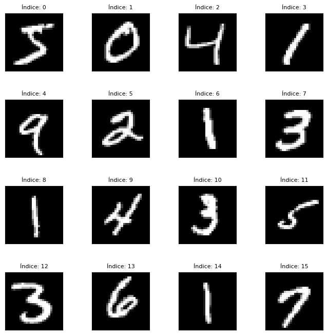
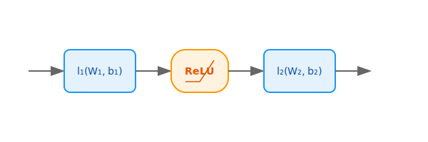

L'objectif va être de d'illustrer la backpropagation **non**-automatique avec `numpy` en réimplémentant l'apprentissage d'un réseau de neuronne simple par un algorithme de descente de gradient.

Pour ça je propose un cadre concret : le problème de la **classification multiple**, pour l'exemple on va prendre MNIST spécifiquement, avec la **perte logistique** (cross-entropy), et un modèle **Multi-Layer Perceptron (MLP)**, qu'on va optimiser par **descente de gradient minibatch (multipass)**.

#### Problème

Je propose le cas concret de MNIST pour l'exemple. 

Le jeu de données $\mathcal{D}_n = (x_i, y_i)_{i \in \{1..n\}}$ est constitué d'images et de labels. C'est un problème de classification, celui de prédire le label $y$ à partir de l'image $x$ par un prédicteur $f_\theta$.

Les $x_i$ sont des images de chiffres, de 0 à 9, elles sont interprétées comme un vecteur de $\R^d$, ou $d = 28 \times 28$ correspond au nombre de pixels de l'image.

Les $y_i$ sont les labels $0 \dots 9$, one-hot encodés, c'est à dire des vecteurs de $\{0, 1\}^k$ avec $k = 10$ et tels que la coordonnée correspondant au label est $1$ et les autres sont $0$.

On a donc $f_\theta \colon \R^{b \times d} \to \R^{b \times k}$ avec $b$ la taille du batch.



La fonction de perte choisie est la perte logistique, c'est à dire que le critère d'optimisation est

$$L(\theta) := \frac{1}{b} \sum_{i=1}^{b} - \log( \sum_{j = 1}^k \sigma(f_\theta(x))_{ij} y_{ij})$$

où $\sigma$ est la fonction softmax, qui généralise la fonction logistique au cas multidimensionnel, et est utilisée pour obtenir des "probabilités de classes" à partir des logits.

$$\sigma(f_\theta(x)) := 

\begin{bmatrix}
\frac{e^{f_\theta(x)_{ij}}}{\sum_{j=1}^{k} e^{f_\theta(x)_{ij}}}
\end{bmatrix}
$$

$f_\theta$ est modélisé par un Multi-Layer Perceptron (MLP), simple mais suffisant bien illustrer la backpropagation et intuiter un algorithme de gradient automatique.

Dans un MLP $L$ couches dites linéaires (de la terminologie anglaise, donc affines en réalité) et $L-1$ fonctions d'activation (ici $ReLU(x) = [\max(0, x_{ij})]$ est choisi) sont alternées.

Pour deux couches ça ressemble à ça :



1. une première couche linéaire $z_1 = x w_1 + 1 b_1^T$ avec $w_1 \in \mathbb{R}^{d \times d_1}$ et $\ b_1 \in \mathbb{R}^{d_1}$ identifié à une matrice colonne
2. une activation ReLU $a_1 = \left[ (z_1)_{ij} \mathbb{1}_{(z_1)_{ij} > 0} \right]$
3. une deuxième couche linéaire pour obtenir les logits $z_2 = a_1 w_2 + 1 b_2^T$

Dans ce modèle le paramètre à optimiser est donc $\theta = (w_1, b_1, w_2, b_2)$

#### Implémentation de la prédiction (forward)

L'implémentation de la prédiction est assez immédiate (voir en bas pour l'implémentation complète) :

```python
import numpy as np

class MLP:
    def __init__(
        self, 
        in_features: int = 28*28, 
        hid_features: int = 28*28//2, 
        out_classes: int = 10
    ):
        ...

    def predict(self, x: np.ndarray, probs: bool = False):
        """Predicts class labels.

        Args:
            x: (B, in_features) np.ndarray

        Returns
            preds: (B, out_classes) np.ndarray - predicted class probabilities (or predicted label)
        """
        b = x.shape[0]
        # Flatten images if necessary
        x = x.reshape((b, -1))
        
        z1 = x @ self.w1 + self.b1
        a1 = relu(z1)
        z2 = a1 @ self.w2 + self.b2

        if probs:
            y_hat = softmax(z2)
        else:
            y_hat = one_hot_encode(
                np.argmax(z2, axis=1, keepdims=True), 
                self.out_classes
            )

        return y_hat
```

#### Implémentation de l'apprentissage (backward & gradient descent step)

Un peu plus de math est à prévoir pour la dérivation des gradients requis pour l'optimisation par descente.

#### Le lien entre opérateur différentiel et gradient

Considère une fonction $f$ de $x$ à valeur réelle.

Dans le cadre du calcul différentiel vectoriel, l'opérateur linéaire $dx$ est défini par la relation $df = D_xf(x) dx$ où $D_xf$ est la différentielle usuelle, au sens de Fréchet, de $f$. Et lorsque $f \colon \R^d \to \R$ est a valeur réelle, le gradient de $f$ au point $x$ est défini comme l'unique vecteur $\nabla_xf \in \R^d$ tel que $D_xf(h) = \langle \nabla_xf, h \rangle$ pour tout $h \in \R^d$.

Il y a alors la relation suivante entre $df$ et $\nabla_xf$ :

$$df = \langle \nabla_x f, dx \rangle = \sum_{j = 1}^{d} \frac{\partial f}{\partial x_j} dx_j$$

Dans le cadre du machine learning, on a usuellement affaire à des matrices ou tenseur plutôt que des vecteurs. 

Les calculs peuvent se gérer dans le cadre du calcul différentiel vectoriel en vectorisant (via l'opérateur $vec$) les tenseur par isomorphisme avec un $\R^\cdot$ (par exemple en empilant les colonnes d'une matrice les unes sur les autres), mais on aimerait avoir un cadre permettant de faire du calcul différentiel tout en conservant la structure matricielle ou tensorielle.

Tout ça peut se définir proprement, voir _calcul différentiel matriciel_ et _calcul différentiel tensoriel en notation indice_ (voir par exemple [Matrix Differential Calculus with Applications in Statistics and Econometrics, by Magnus and Neudecker](https://www.janmagnus.nl/misc/mdc-ch18.pdf)), mais je vais me contenter de redonner les deux résultats immédiatement utiles.

Dans le cadre matriciel, avec $x \in \mathbb{R}^{n \times d}$ et en notant $\langle\cdot,\cdot\rangle_F$ le produit scalaire de Frobenius, il y a :

$$df = \langle \nabla_x f, dx \rangle_F = \sum_{i = 1}^{n} \sum_{j = 1}^{d} \frac{\partial f}{\partial x_{ij}} dx_{ij} = tr((\nabla_x f)^T dx)$$

Dans le cadre tensoriel, avec $x \in \mathbb{R}^{n \times h \times w}$ et en notant toujours $\langle\cdot,\cdot\rangle_F$ le produit scalaire de Frobenius (généralisé aux tenseurs), il y a :

  $$df = \langle \nabla_x f, dx \rangle_F = \sum_{i = 1}^{n} \sum_{k = 1}^{h} \sum_{l = 1}^{w} \frac{\partial f}{\partial x_{ikl}} dx_{ikl}$$

#### Calcul des gradients pour le MLP

#### Backpropagation du gradients pour une couche linéaire

Suppose que $y = xw + 1b^T$ et qu'on dispose du gradient de $l$ selon $y$, noté $\nabla_y l$. Il s'agit de retrouver celui de $l$ selon $w$, noté $\nabla_w l$.

$$
\begin{align*}
dl 
&= \langle \nabla_y l, dy \rangle \\
&= \langle \nabla_y, xdw \rangle \\
&= tr((\nabla_y l)^Txdw) \\
&= tr((x^T \nabla_y l)^T dw) \\
&= \langle x^T \nabla_y l, dw \rangle
\end{align*}
$$

Donc $\nabla_w l = x^T \nabla_y l$

$$
\begin{align*}
dl 
&= \langle \nabla_y l, dy \rangle \\
&= \langle \nabla_y l, 1d(b^\top) \rangle \\
&= \langle \nabla_y l, db 1^\top \rangle \\
&= \langle \nabla_y l 1, db \rangle \\
\end{align*}
$$

Et donc $\nabla_w l = \nabla_y l 1$


#### Backpropagation du gradient pour les fonctions réelles vectorisées (dont ReLU)

Une grande partie des fonctions implémentée dans `numpy` ou `torch` sont des fonctions réelles vectorisées, c'est à dire qu'on peut les écrire $[y_{ij}] = [\sigma(x_{ij})]$ avec $\sigma$ une fonction $\mathbb{R} \to \mathbb{R}$. Le gradient de ces fonctions ci se retrouve facilement

$$
\begin{align*}
dl 
&= \langle \nabla_y l, dy \rangle \\
&= \langle \nabla_y l, d[\sigma(x_{ij})] \rangle \\
&= \langle \nabla_y l, [d\sigma(x_{ij})] \rangle \\
&= \langle \nabla_y l, [\sigma(x_{ij})' dx_{ij}] \rangle \\
&= \langle \nabla_y l, [\sigma(x_{ij})'] \odot dx \rangle \\
&= \langle [\sigma(x_{ij})'] \odot \nabla_y l, dx \rangle
\end{align*}
$$

Donc $\nabla_x l = [\sigma(x_{ij})'] \odot \nabla_y l$

_Quoiqu'il aurait été plus simple de procéder par dérivées partielles ici._

#### Gradient de la perte logistique

Un petit peu plus fastidieux, considère déjà le cas sans minibatch, vectoriel, avec $z, y \in \R^k$ où $z = f_\theta(x)$ sont les logits prédits par le modèle.

$$l(z, y) := - \log \sum_{j = 1}^{k} \sigma(z_j) y_j = - z_{j(y)} + \log \sum_{j = 1}^{k} e^{z_j}$$

où $\sigma$ est la fonction $softmax$ et $j(y) \in \{0 \dots k-1\}$ est la classe de $x$ (c'est la seul coordonnée de $y$ non nulle).

Alors les dérivées partielles de $l$ sont

$$\frac{\partial}{\partial z_j} l(z, y) = - y_{j} + \sigma(z)_j$$

et donc son gradient est

$$\nabla_z l(z, y) = \sigma(z) - y$$

Maintenant le problème est que $z, y \in \R^{b \times k}$ et qu'on s'intéresse à $L(z, y) = \frac{1}{b} \sum_{i = 1}^{b} l(z_i, y_i)$ où $z_i, y_i$ sont les lignes de $x, y$, or

$$
\begin{align*}
dL 
&= \frac{1}{b} \sum_{i = 1}^{b} dl \\
&= \frac{1}{b} \sum_{i = 1}^{b} \langle \nabla_{z_i}l, dz_i \rangle \\
&= \frac{1}{b} \ tr \left(

\begin{bmatrix}
    \vdots \\
    \nabla_{z_i} l^\top \\
    \vdots \\
\end{bmatrix}

\begin{bmatrix} \cdots dz_i \cdots \end{bmatrix}

\right)
\end{align*}
$$

Et donc on identifie 

$$
\nabla_zL = 
\begin{bmatrix}
    \vdots \\
    (\sigma(z_i) - y_i)^\top \\
    \vdots \\
\end{bmatrix}
$$

$\square$

#### Ouverture sur la différentiation automatique - `autograd`

Comme ici, ce qui nous intéresse en machine learning (et en optimisation numérique en général) ce sont des compositions de fonctions tensorielles aboutissant en une fonction réelle.

Prenons le cas concret $loss = l \circ f$.

$$
\begin{align*}
% Id: \R &\to \R 
\quad l \colon \R^q &\to \R  
&\quad f \colon \R^p, \R^{p \times q} &\to \R^q \\

% loss &\mapsto loss 
y &\mapsto l(y) 
& x, \theta &\mapsto f(x, \theta) 
\end{align*}
$$

Alos vu ce qui précède, il suffit de définir

$$
\begin{align*}
% Id_{grad} \colon \R &\to \R
\quad l_{grad} \colon \R &\to \R^q  
&\quad f_{grad} \colon \R^q &\to \R^p, \R^{p \times q} \\

% \cdot &\mapsto \nabla_{loss} Id = 1
\nabla_{l} l &\mapsto \nabla_y l
&\nabla_y l &\mapsto \nabla_x l, \nabla_{\theta} l
\end{align*}
$$

_Note que $\nabla_l l = 1$ simplement, ce qui est parfaitement cohérent du point de vu mathématique $\frac{dl}{d\theta} = \frac{dl}{dl} \frac{dl}{df} \frac{df}{d\theta}$, mais n'empêcherait pas de composer $l_{grad}$ avec une autre $\cdot_{grad}$ si $l$ elle même l'était._

Donc il est clair que si on implémente $\cdot_{grad}$ pour chaque opération élémentaire (addition, multiplication, produit matriciel, exponentielle, etc) puisque toute les autres fonctions sont construites à partir de celles ci, il sera possible de dériver automatiquement tous les gradients. _Restera à construire un graphe des compositions en forward, pour le parcourir en backward._

#### Implémentation

```python
from typing import (
    Literal,
    Optional,
    Tuple
)

from mnists import MNIST
import numpy as np


def load_data(split: Literal["train", "test"] = "train", batch_size: Optional[int] = None, shuffle: bool = True):
    """Simple dataloader."""

    data = MNIST()

    if split == "train":
        x, y = data.train_images(), data.train_labels()
    elif split == "test":
        x, y = data.test_images(), data.test_labels()
    else:
        raise ValueError(f"Unknown split : '{split}'")

    n = x.shape[0]

    if shuffle:
        permutation = np.random.permutation(n)
        x = x[permutation]
        y = y[permutation]

    if batch_size is None:
        yield x / 255, one_hot_encode(y, k=10)
    else:
        a = 0
        b = min(batch_size, n)

        while a < n:
            yield x[a:b] / 255, one_hot_encode(y[a:b], k=10)
            a = b
            b = min(a + batch_size, n)
        
def softmax(logits: np.ndarray) -> np.ndarray:
    """Softmax activation function, converts logits into probability vector.

    Applies softmax to the last dimension of tensor `logits`.
    
    Args:
        logits: (B, ..., D) np.ndarray
        
    Returns:
        probs: (B, ..., D) np.ndarray
    """
    # For numerical stability we shift logits so they are all negative 
    # ensuring the exp doesn't explode, the result is the same since
    # we can factor out exp(shift) from numerator and denominator
    logits = logits - np.max(logits, axis=-1, keepdims=True)
    exp_logits = np.exp(logits)

    return exp_logits / np.sum(exp_logits, axis=-1, keepdims=True)


def cross_entropy_loss(y_hat: np.ndarray, y: np.ndarray, epsilon: float = 1e-8) -> float:
    """Cross-entropy (logistic) loss function.
    
    This function expects `y_hat` to be a batch of probability vectors, ensure logits
    have been activated (e.g. softmax) 
    
    Args:
        y_hat: (B, D) ndarray
        y: (B, D) ndarray or (B, 1) ndarray - correct class labels, eventually one-hot encoded
        
    Returns:
        loss: float
    """
    y_hat = np.clip(y_hat, epsilon, 1. - epsilon)
    return - np.sum(y * np.log(y_hat)) / y.shape[0]

def accuracy_metric(y_hat: np.ndarray, y: np.ndarray) -> float:
    """Accuracy metric.
    
    This function expects `y` to have been one-hot encoded.
    
    Args:
        y_hat: (B, D) ndarray
        y: (B, D) ndarray
        
    Returns:
        accuracy: float
    """
    return float(np.sum(y_hat * y) / y_hat.shape[0])


def relu(x: np.ndarray):
    """ReLU activation function."""
    return np.clip(x, a_min=0, a_max=None)


def one_hot_encode(y: np.ndarray, k: int = 2):
    """One-hot encode class labels."""
    n = y.shape[0]

    y_oh = np.zeros((n, k))
    y_oh[np.arange(n), y.flatten()] = 1

    return y_oh


class MLP:
    """Multi-Layer Perceptron for Classification.
    
    This MLP embbeds a cross entropy (logistic) loss function
    and is trained by a simple minibatch multipass SGD.
    """

    def __init__(
        self, 
        in_features: int = 28*28, 
        hid_features: int = 28*28//2, 
        out_classes: int = 10,
        learning_rate: float = 0.001
    ):
        # Initializes parameters, best practice is to use 
        # some random initialization for better learning stability
        # see [He initialization](https://en.wikipedia.org/wiki/Weight_initialization)
        self.w1 = np.random.normal(0, np.sqrt(2/in_features), (in_features, hid_features))
        self.b1 = np.zeros((1, hid_features))

        self.w2 = np.random.normal(0, np.sqrt(2/hid_features), (hid_features, out_classes))
        self.b2 = np.zeros((1, out_classes))

        self.learning_rate = learning_rate
        self.out_classes = out_classes

    def predict(self, x: np.ndarray, probs: bool = False):
        """Predicts class labels.

        Args:
            x: (B, in_features) np.ndarray

        Returns
            preds: (B, out_classes) np.ndarray - predicted class probabilities (or predicted label)
        """
        b = x.shape[0]
        # Flattens images if necessary
        x = x.reshape((b, -1))
        
        z1 = x @ self.w1 + self.b1
        a1 = relu(z1)
        z2 = a1 @ self.w2 + self.b2

        if probs:
            # Final activation to "class probabilities"
            y_hat = softmax(z2)
        else:
            y_hat = one_hot_encode(np.argmax(z2, axis=1, keepdims=True), self.out_classes)

        return y_hat

    def train(self, x: np.ndarray, y: np.ndarray, probs: bool = False) -> Tuple[float, np.ndarray]:
        """Fits to a new batch of data with SGD.

        Args:
            x: (B, in_features) np.ndarray
            y: (B, out_classes) np.ndarray

        Returns:
            loss: float - batch cross entropy loss
            preds: (B, out_classes) np.ndarray - predicted class probabilities (or predicted label)
        """
        b = x.shape[0]
        # Flattens images if necessary
        x = x.reshape((b, -1))

        # Forward pass
        z1 = x @ self.w1 + self.b1
        a1 = relu(z1)
        z2 = a1 @ self.w2 + self.b2

        # Final activation to "class probabilities"
        y_hat = softmax(z2)

        # Gradients computation, the chain rule in action
        # 
        # Implementations often use the d<output> notation but we are indeed
        # computing gradients here, not differentials
        dz2 = (y_hat - y) / b
        dw2 = a1.T @ dz2
        db2 = np.sum(dz2, axis=0, keepdims=True)

        da1 = dz2 @ self.w2.T
        dz1 = (z1 > 0).astype(float) * da1
        dw1 = x.T @ dz1
        db1 = np.sum(dz1, axis=0, keepdims=True)

        # Gradient Descent
        self.w2 -= self.learning_rate * dw2
        self.b2 -= self.learning_rate * db2
        self.w1 -= self.learning_rate * dw1
        self.b1 -= self.learning_rate * db1

        if not probs:
            y_hat = one_hot_encode(np.argmax(y_hat, axis=1, keepdims=True), self.out_classes)

        return cross_entropy_loss(y_hat, y), y_hat


def main(
    epochs: int = 10,
    learning_rate: float = 0.1
):
    model = MLP(
        in_features=28*28,
        hid_features=28*28//4,
        out_classes=10,
        learning_rate=learning_rate
    )

    for epoch in range(epochs):
        epoch_losses = []
        epoch_accuracies = []

        for x_train, y_train in load_data(split="train", batch_size=32, shuffle=True):
            epoch_loss, y_hat = model.train(x_train, y_train)
            epoch_losses.append(epoch_loss)
            epoch_accuracies.append(accuracy_metric(y_hat, y_train))

        print(f"Epoch {epoch + 1} : loss={np.mean(epoch_losses):.4f} +/-{np.std(epoch_losses):.4f} accuracy(train)={np.mean(epoch_accuracies):.4f}")

    accuracies = []
    for x_test, y_test in load_data(split="test", batch_size=32, shuffle=False):
        y_hat = model.predict(x_test)
        accuracies.append(accuracy_metric(y_hat, y_test))

    print(f"accuracy={np.mean(accuracies):.4f}")
   


if __name__ == "__main__":
    main()
```

Lançons l'expérience

```bash
Epoch 1 : loss=1.5111 +/-1.3290 accuracy(train)=0.9180
Epoch 2 : loss=0.7163 +/-0.6453 accuracy(train)=0.9611
Epoch 3 : loss=0.5250 +/-0.5371 accuracy(train)=0.9715
Epoch 4 : loss=0.3964 +/-0.4793 accuracy(train)=0.9785
Epoch 5 : loss=0.3199 +/-0.4206 accuracy(train)=0.9826
Epoch 6 : loss=0.2772 +/-0.3948 accuracy(train)=0.9849
Epoch 7 : loss=0.2315 +/-0.3638 accuracy(train)=0.9874
Epoch 8 : loss=0.1805 +/-0.3195 accuracy(train)=0.9902
Epoch 9 : loss=0.1486 +/-0.2999 accuracy(train)=0.9919
Epoch 10 : loss=0.1246 +/-0.2699 accuracy(train)=0.9932
accuracy=0.9801
```

On apprend ! Et, sans trop de surprise, on a bien overfit. _Cette boucle d'entrainement n'est pas bonne (du tout, mais elle est simple)._ Qu'importe, la minimisation de la perte au fil des epochs est bien visible, et **0.98** n'est pas très impressionnant mais a le mérite de battre les classifieurs linéaires. _Il sera facile d'augmenter cette accuracy sans modification complexe (un peu plus de couches, augmenter les données, et surtout passer à des couches de convolution)._
